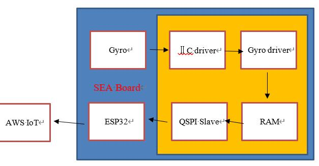

# YaoYaoLe
>  这是一个基于FPGA的摇摇乐小游戏 
>
> 2020年新工科联盟-Xilinx暑期学校（Summer School）项目。

### Inctroduction

##### 项目简介

本项目是一个基于`FPGA`的3D姿态模拟项目，通过读取板载陀螺仪的姿态数据，上传至远程服务器，展示3D姿态模型。这是一个实时的姿态传输系统，能够将联网的设备(`Sea-Board`)的姿态信息（如何转动等）上传至远程服务器进行展示，展示的方式是在线的3D模型（目前还是简略版）。

##### 项目系统

> 这是项目组件的结构

##### 项目实现

- 板载的陀螺仪通过IIC与陀螺仪驱动模块传递原始的陀螺仪 姿态数据
- 驱动模块将原始数据经过处理后存于`RAM`，利用`RAM`与`QSPI`模块，esp32可以通过`QSPI`接口访问RAM中的数据
- Esp32连接`AWS IoT`，将陀螺仪板载数据上传至IoT云端。
- 利用`IoT`云端 `Web API`，将云上数据传给其他WeB服务（此项目中为网站服务器），用于呈现3D在线姿态模拟。

__这是现阶段的demo__

