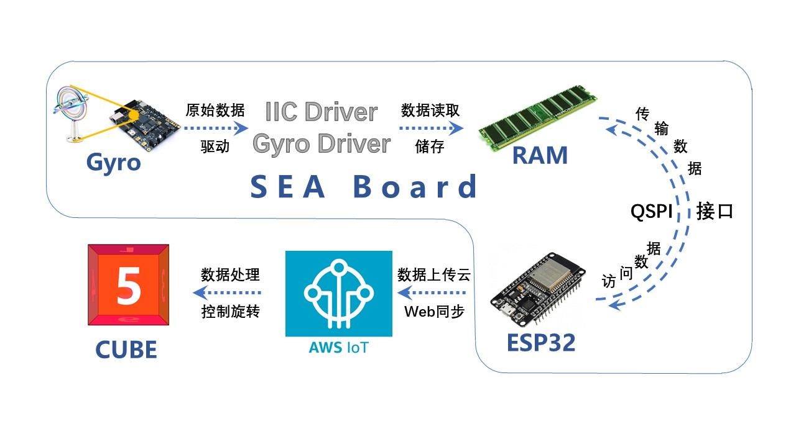

# 摇摇乐

  > #### [English](README_EN.md)|中文
  >
  >  这是一个基于FPGA的“摇摇乐”3D实时姿态同步工具。 
  >
  >  2020年新工科联盟-Xilinx暑期学校（Summer School）项目

---

  ## 介绍

  #### 项目简介

  - 本项目是一个基于`FPGA`的3D姿态模拟项目，通过读取板载陀螺仪的姿态数据，上传至远程服务器，展示3D姿态模型。这是一个实时的姿态传输系统，能够将通过`WiFi`联网的设备(`Sea-Board`)的姿态信息（如何转动等）上传至远程服务器进行展示，展示的方式是实时的3D模型：一个六面的方块cube（目前还是简略版）。

  

  #### 项目系统

  这是项目组件的结构框图

  

  

---

  

  ## 安装

  - 该项目使用[Vivado(2019.1)](https://www.xilinx.com/support/download/index.html/content/xilinx/en/downloadNav/vivado-design-tools/2019-1.html)和[Arduino(1.8.13)](https://www.arduino.cc/en/Main/Software)。 如果您没有在本地安装它们，请点击链接下载安装。

  

---

  

  ## 实现步骤

  

  - 板载的陀螺仪通过`IIC`与陀螺仪驱动模块传递原始的陀螺仪姿态数据。
  - 驱动模块将原始数据经过处理后存于`RAM`，利用`RAM`与`QSPI`模块，Esp32可以通过`QSPI`接口访问RAM中的数据。
  - Esp32连接`AWS IoT`，将板载陀螺仪数据上传至`IoT`云端。
  - 创建`HTML`网页，实现可绕中心轴旋转的6面`cube`，每一面附上不同的颜色的数字加以区分。
  - 利用`IoT`云端 `Web API`，将云上数据传给其他Web服务（此项目中为网站服务器），用于呈现`cube`3D姿态在线模拟。

  

---

  

  ## 项目演示

  这是现阶段的demo

  

  

---

  

  ## 项目拓展

  - 在实时姿态展示的HTML网页上，`cube`六面魔方可以替换为各类3D物样（如方向盘，小车，卡通人物，不倒翁等等）。

  - 通过修改网页上的模型，或增添一些交互，可以模拟开车，玩不倒翁等等，实现许多拓展功能，发挥潜力很大。

  

---

  

  ## 更新日志

  #### v0.1.1

  - 修改了三轴角速度数据的传输关系，解决了板载陀螺仪与网页`cube`翻转方向同步一致的问题。

  - 更新完善了项目系统的结构。

    

  #### v0.1.2

  - 更新了刷新频率，优化了`cube`旋转的灵敏度。
