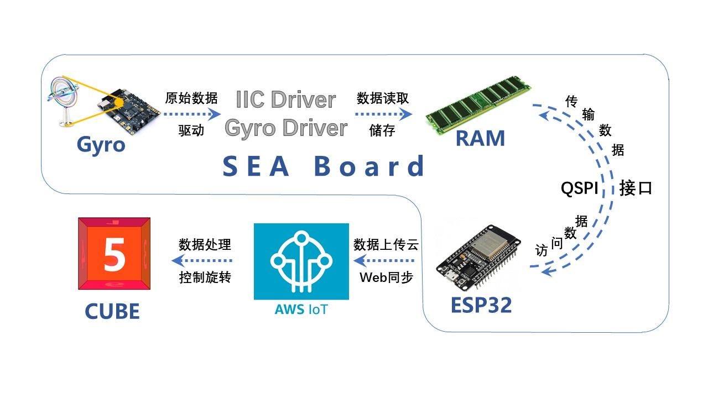

# YaoYaoLe

  > #### English|[中文](README.md)
  >
  >  This is an FPGA-based "shaking music" 3D real-time attitude synchronization tool.
  >
  >  2020 New Engineering Alliance-Xilinx Summer School (Summer School) project

  ---

  ## Inctroduction

  #### Project Description

  - This project is a 3D posture simulation project based on `FPGA`. It reads the posture data of the onboard gyroscope and uploads it to the remote server to display the 3D posture model. This is a real-time attitude transmission system, which can upload the attitude information (how to rotate, etc.) of the device (`Sea-Board`) networked via `WiFi` to a remote server for display. The display method is a real-time 3D model: a Six-sided cube cube (currently still a short version).

  

  #### Project system

  This is the structure diagram of the project components

  

  

  ---

  

  ## Install

  - This project uses [Vivado(2019.1)](https://www.xilinx.com/support/download/index.html/content/xilinx/en/downloadNav/vivado-design-tools/2019-1.html) and [Arduino(1.8.13)](https://www.arduino.cc/en/Main/Software). Go check them out if you don't have them locally installed.

  

  ---

  

  ## Deployment steps

  - The onboard gyroscope transmits the original gyroscope attitude data through the IIC and gyroscope drive module.

  - The driver module stores the original data in `RAM` after processing. Using `RAM` and `QSPI` modules, Esp32 can access the data in RAM through the `QSPI` interface.

  - Esp32 connects to `AWS IoT` and uploads the onboard gyroscope data to the `IoT` cloud.

  - Create a `HTML` web page to realize a 6-sided `cube` that can rotate around the central axis, and each side is distinguished by a number with a different color.

  - Use the `IoT` cloud `Web API` to transfer cloud data to other web services (web server in this project), which is used to present the `cube` 3D posture online simulation.

  

  ---

  

  ## Project demo

  This is the demo at this stage

  

  

  ---

  

  ## Project expand

  - On the HTML webpage displayed in real-time posture, the `cube` can be replaced with various 3D objects (such as steering wheels, cars, cartoon characters, tumblers, etc.). 

  - By modifying the model on the webpage, or adding some interactions, you can simulate driving, play a tumbler, etc., realize many expansion functions, and exert great potential.

  

  ---

  

  ## Change Log

  #### v0.1.1

  - Modified the three-axis angular velocity data transmission relationship, and solved the problem that the on-board gyroscope is synchronized with the flip direction of the webpage `cube`.

  - Updated and improved the structure of the project system.

    

  #### v0.1.2

  - The refresh rate has been updated and the sensitivity of the `cube` rotation has been optimized.
